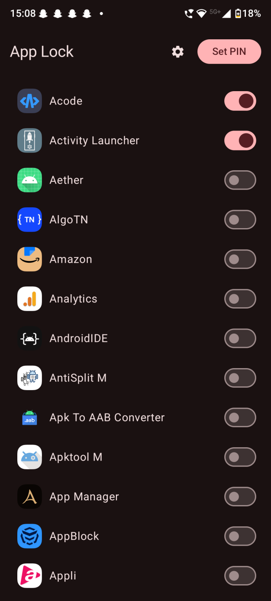
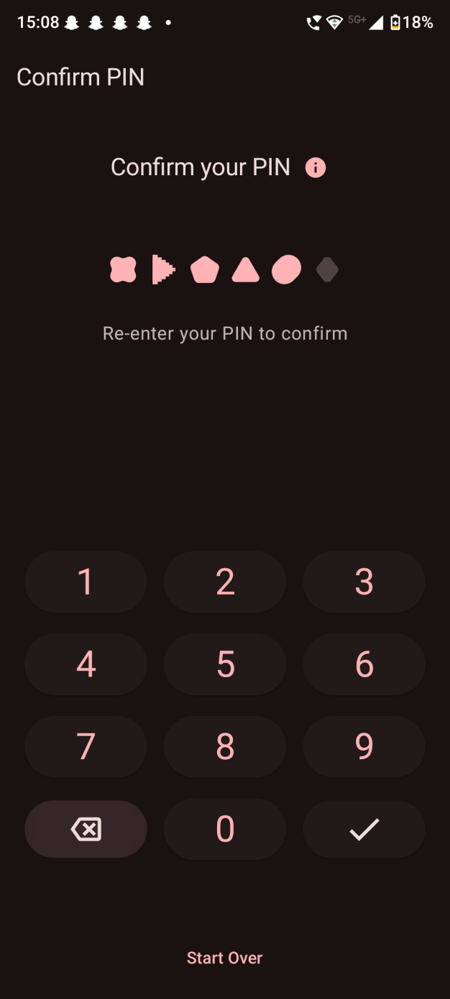
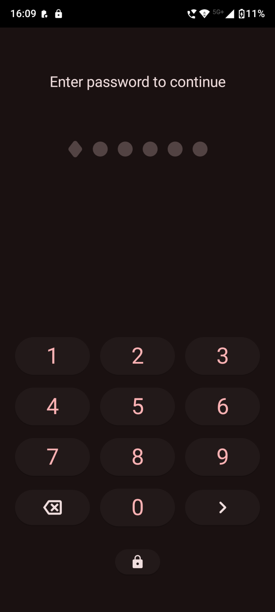

<!--suppress HtmlDeprecatedAttribute -->
<div align="center">
  
</div>

<h1 align="center"><b>AppLock</b></h1>
<p align="center"><b>Privacy Protection Reimagined</b></p>

<div align="center">
  <a href="https://opensource.org/licenses/MIT">
    
  </a>
  <a href="#">
    
  </a>
</div>

<br>

<div align="center">
  
  
  
  
</div>

<br>
<p align="center"><em>AppLock in action: Securing your sensitive apps.</em></p>
<br>

## ✨ App Protection

**AppLock** provides powerful app protection with an intuitive Material You interface, seamlessly
integrating with your device's aesthetic while ensuring robust security for your private
applications.

<br>

## 🛠️ Key Features

- **🎨 Material You Design** - Beautiful adaptive UI that complements your system theme
- **👆 Biometric Security** - Unlock apps instantly with fingerprint or face recognition
- **🔒 One-Tap Protection** - Secure any app with a simple toggle
- **🔍 Smart Search** - Find apps quickly with intelligent filtering
- **🔐 Complete Privacy** - All security data stays on your device
- **⚡ Real-time Protection** - Background monitoring to secure apps as they launch

<br>

## 💡 Technical Highlights

- **Jetpack Compose UI** - Modern declarative interface with Material 3
- **Biometric Integration** - Seamless authentication using the latest APIs
- **Background Processing** - Efficient foreground service with UsageStatsManager
- **Persistence Layer** - Reliable data storage with preference encryption
- **Custom Animations** - Smooth transitions and micro-interactions
- **Permission Handling** - Intuitive flows for necessary system access

<br>

## Donate

If you find this project helpful, consider supporting it by donating via PayPal:


[](https://paypal.me/pranavpurwar)

## 📱 Perfect For

- Privacy-conscious users who share devices with others
- Parents who want to control kids' access to specific apps
- Professionals who need to protect sensitive work applications
- Anyone who values both security and beautiful design

<br>

## 🔨 For Developers

AppLock serves as an excellent reference implementation for:

- Material 3 design principles in Jetpack Compose
- System service integration (UsageStatsManager, BiometricPrompt)
- Foreground service implementation with notifications
- Real-time app monitoring techniques
- Practical UI implementation with Jetpack Compose

```bash
# Clone and build
git clone https://github.com/PranavPurwar/AppLock.git
./gradlew assembleDebug
```

<br>

## 📄 License

```
MIT License

Copyright (c) 2023-2025 Pranav Purwar

Permission is hereby granted, free of charge, to any person obtaining a copy
of this software and associated documentation files (the "Software"), to deal
in the Software without restriction, including without limitation the rights
to use, copy, modify, merge, publish, distribute, sublicense, and/or sell
copies of the Software, and to permit persons to whom the Software is
furnished to do so, subject to the following conditions:

The above copyright notice and this permission notice shall be included in all
copies or substantial portions of the Software.

THE SOFTWARE IS PROVIDED "AS IS", WITHOUT WARRANTY OF ANY KIND, EXPRESS OR
IMPLIED, INCLUDING BUT NOT LIMITED TO THE WARRANTIES OF MERCHANTABILITY,
FITNESS FOR A PARTICULAR PURPOSE AND NONINFRINGEMENT. IN NO EVENT SHALL THE
AUTHORS OR COPYRIGHT HOLDERS BE LIABLE FOR ANY CLAIM, DAMAGES OR OTHER
LIABILITY, WHETHER IN AN ACTION OF CONTRACT, TORT OR OTHERWISE, ARISING FROM,
OUT OF OR IN CONNECTION WITH THE SOFTWARE OR THE USE OR OTHER DEALINGS IN THE
SOFTWARE.
```
