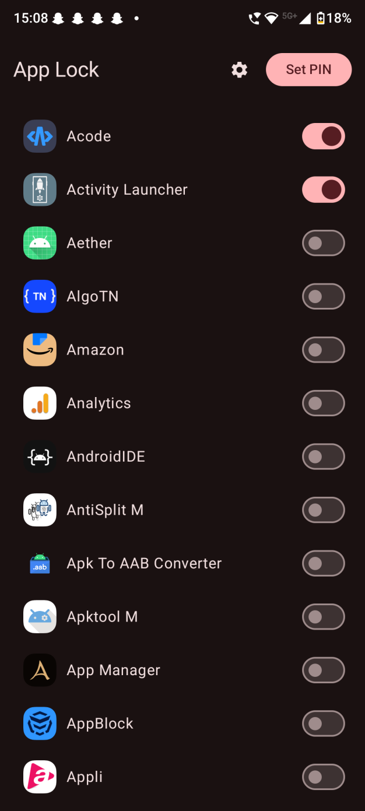
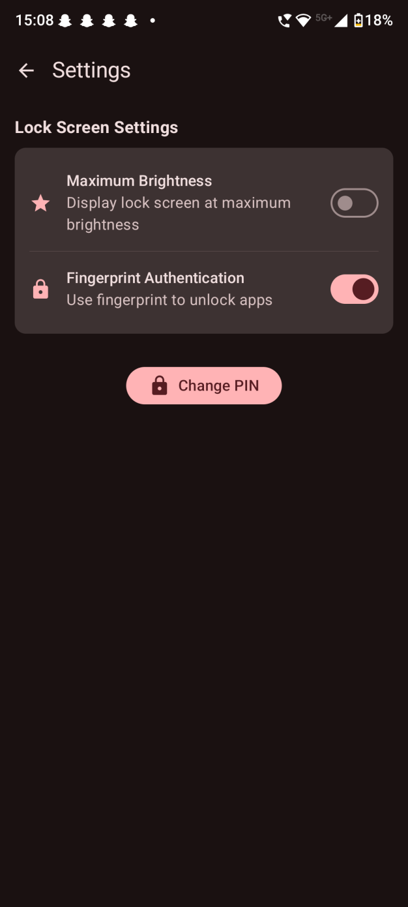
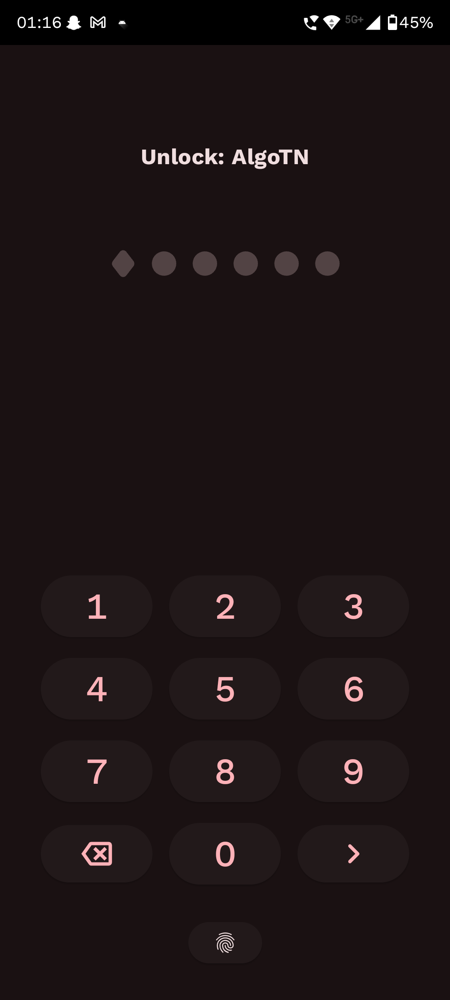
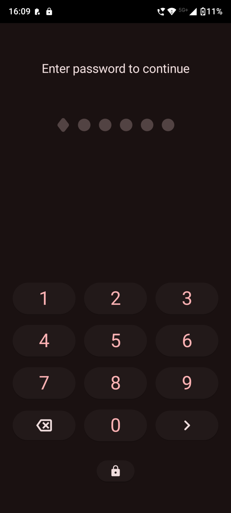
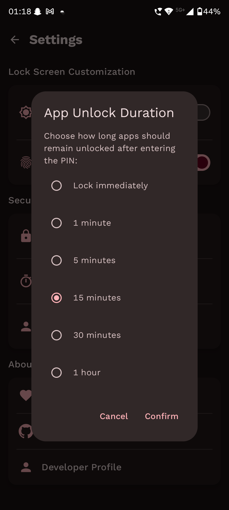

<div align="center">
  
</div>

<h1 align="center">AppLock</h1>
<p align="center"><b>Open Source Android App Locker & Privacy Guard</b></p>

<p align="center">
  <a href="https://opensource.org/licenses/MIT">
    
  </a>
  <a href="https://github.com/PranavPurwar/AppLock/releases">
    
  </a>
  <a href="https://apt.izzysoft.de/packages/dev.pranav.applock">
    
  </a>
  <a href="https://paypal.me/pranavpurwar">
    
  </a>
</p>

<p align="center">
  
  
  
</p>

<p align="center">
  
  
</p>

---

## Overview

AppLock is a modern, open-source Android app locker designed to protect your privacy and sensitive
data. Lock any app, prevent unauthorized access, and enjoy a seamless Material You experience. No
root required.

<b></b>

## Features

- Material You design, adapts to your theme
- Biometric and PIN authentication
- Anti-uninstall protection
- Unlock timeout for convenience
- No root required
- One-tap app locking
- All data stays on your device
- Real-time background protection
- Lightweight and fast

<b></b>

## Download

The app is available for download via IzzyOnDroid aswell
as [Github Releases](https://github.com/PranavPurwar/AppLock/releases/latest).

<a href="https://apt.izzysoft.de/packages/dev.pranav.applock">
    
  </a>

Beta Builds can be
found [here](https://github.com/PranavPurwar/AppLock/raw/refs/heads/master/app/release/app-release.apk)

<b></b>

## Use Cases

- Shared devices
- Parental controls
- Protecting work apps
- General privacy

<b></b>

## Developer Guide

AppLock demonstrates:

- Jetpack Compose + Material 3
- BiometricPrompt integration
- Accessibility Service for app monitoring
- Encrypted on-device storage
- Clean Architecture

```bash
git clone https://github.com/PranavPurwar/AppLock.git
cd AppLock
./gradlew assembleDebug
```

<b></b>

## Contributing

Contributions are welcome! Please follow these steps:

1. Fork the repository
2. Create a new branch (`git checkout -b feature/YourFeature`)
3. Make your changes
4. Commit your changes (`git commit -m 'Add some feature'`)
5. Push to the branch (`git push origin feature/YourFeature`)
6. Open a pull request

<b></b>

### Code Style

- Follow Kotlin coding conventions
- Use meaningful commit messages
- Ensure code is well-documented

<b></b>

## Support

If you find AppLock useful, consider supporting development:

[](https://paypal.me/pranavpurwar)

---

## License

```text
MIT License

Copyright (c) 2023-2025 Pranav Purwar

Permission is hereby granted, free of charge, to any person obtaining a copy
of this software and associated documentation files (the "Software"), to deal
in the Software without restriction, including without limitation the rights
to use, copy, modify, merge, publish, distribute, sublicense, and/or sell
copies of the Software, and to permit persons to whom the Software is
furnished to do so, subject to the following conditions:

The above copyright notice and this permission notice shall be included in all
copies or substantial portions of the Software.

THE SOFTWARE IS PROVIDED "AS IS", WITHOUT WARRANTY OF ANY KIND, EXPRESS OR
IMPLIED, INCLUDING BUT NOT LIMITED TO THE WARRANTIES OF MERCHANTABILITY,
FITNESS FOR A PARTICULAR PURPOSE AND NONINFRINGEMENT. IN NO EVENT SHALL THE
AUTHORS OR COPYRIGHT HOLDERS BE LIABLE FOR ANY CLAIM, DAMAGES OR OTHER
LIABILITY, WHETHER IN AN ACTION OF CONTRACT, TORT OR OTHERWISE, ARISING FROM,
OUT OF OR IN CONNECTION WITH THE SOFTWARE OR THE USE OR OTHER DEALINGS IN THE
SOFTWARE.
```
